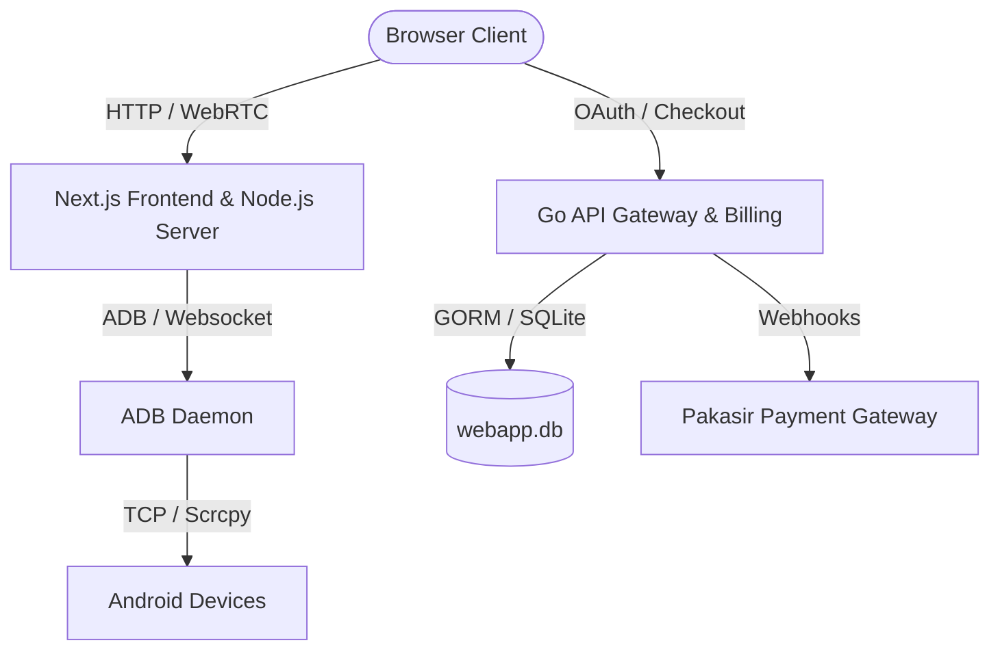

# CloudPhone Web Client & Gateway 📱⚡

[](https://nextjs.org/)
[](https://go.dev/)
[](https://www.typescriptlang.org/)
[](https://www.sqlite.org/)

A high-performance, web-based Android streaming and rental platform. This platform allows users to rent Android devices, control them directly in the browser via low-latency video streaming (powered by `scrcpy` and WebSockets/WebRTC), make automated payments via **Pakasir Payment Gateway**, and redeem custom vouchers.

---

## 🏗️ Architecture Overview

The system consists of two primary services:



1. **Next.js & Node.js Server (Ports 3000 / 8000)**: 
   - Handles low-latency video streaming (`scrcpy-server` over WebSockets/WebRTC).
   - Interactive user control (keyboard/mouse capture, clipboard synchronization).
   - Connects directly to local or network-attached Android devices via ADB.
2. **Go Backend (Port 8080)**:
   - Handles user session management and authentication via **Google OAuth**.
   - Integrates with the **Pakasir API** for billing and checkout transactions.
   - Hosts the secure **Redemption Voucher System** for custom device durations and RAM tiers (4GB, 6GB, 8GB).
   - Database operations (SQLite + GORM).

---

## ✨ Key Features

- 🖥️ **Low-Latency Screen Streaming**: High-quality video feed using WebRTC or Webcodecs decoding directly inside the browser.
- ⌨️ **Interactive Controls**: Touch, click, scroll, and type on the remote Android screen with full clipboard sync.
- 💳 **Automated Checkout**: Instant billing integration via Pakasir (DOKU) supporting QRIS, bank transfers, etc.
- 🎁 **Redemption System**: Voucher-code system to rent new devices or extend current subscriptions by hardware tier (4GB, 6GB, 8GB RAM).
- 🔑 **Google OAuth**: Fast and secure authentication.

---

## 🚀 Getting Started

### Prerequisites

Make sure you have the following installed on your machine:
- **Node.js** (v18 or higher)
- **Go** (v1.20 or higher)
- **Android SDK Platform Tools** (with `adb` set up in your system PATH)
- **SQLite**

---

### Setup Guide

#### 1. Configure Environment Variables
Create a `.env` file in the root folder of the project (and also inside the `frontend/` directory):
```env
GOOGLE_CLIENT_ID="your-google-oauth-client-id"
GOOGLE_CLIENT_SECRET="your-google-oauth-client-secret"
```

#### 2. Run Go Gateway & Billing Server
Navigate to the `frontend` folder, install Go dependencies, and run:
```bash
cd frontend
go mod tidy
go run .
# Or build the binary
go build -o webapp
./webapp
```
*The Go server runs on **`http://localhost:8080`***.

#### 3. Run Node.js & Next.js Server
From the project root folder, install npm dependencies and run the development server:
```bash
npm install
npm run dev
```
*The Next.js client runs on **`http://localhost:3000`** and the ADB stream socket server on **`http://localhost:8000`***.

---

## 🎁 Redemption Code API Reference

### 1. Generate a Voucher Code
- **Endpoint**: `POST /api/redemption/generate`
- **Request Body**:
  ```json
  {
    "tier": "ram4gb",
    "duration": "7h",
    "type": "new"
  }
  ```
  *(Options for tier: `ram4gb`, `ram6gb`, `ram8gb`. Options for duration: `7h`, `24h`, `7d`)*

### 2. Redeem Code for New Device
- **Endpoint**: `POST /api/redemption/redeem/new`
- **Request Body**:
  ```json
  {
    "code": "YOUR_REDEMPTION_CODE"
  }
  ```

### 3. Redeem Code to Extend Device Subscription
- **Endpoint**: `POST /api/redemption/redeem/extend`
- **Request Body**:
  ```json
  {
    "code": "YOUR_REDEMPTION_CODE",
    "device_udid": "DEVICE_SERIAL_UDID"
  }
  ```

---

## 🛡️ Git & Security Warning

1. **Never commit `.env` files** or SQLite `.db` databases. These are ignored by `.gitignore`.
2. Do not commit build outputs or binaries like `.exe` or `webapp-linux`.
3. If GitHub Push Protection blocks your commit, make sure you did not hardcode credentials in `frontend/main.go`.

---

## 📄 License
This project is private and proprietary.
